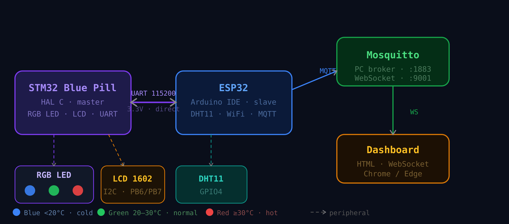
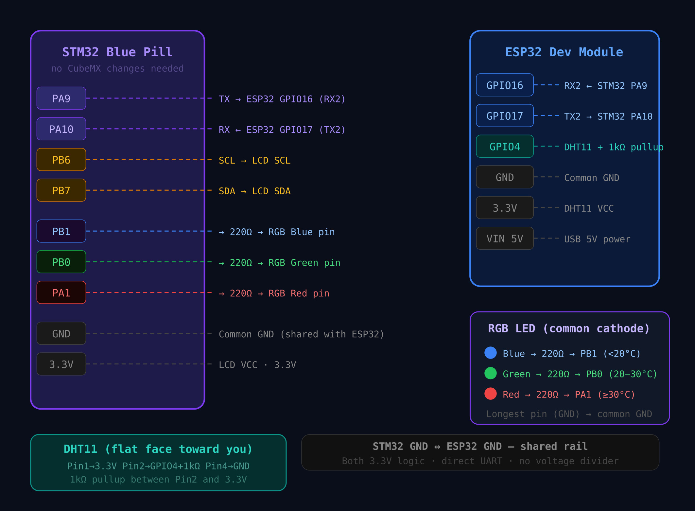

# STM32 + ESP32 · UART & MQTT Sensor Node

A two-board embedded IoT system. The **STM32 Blue Pill** acts as UART master — it drives LEDs and an LCD display based on temperature thresholds. The **ESP32** reads a DHT11 sensor, sends data to the STM32 over UART, publishes to a **Mosquitto MQTT broker**, and the data is visualised in a **standalone HTML dashboard** with CSV export and offline analysis.

---
## Project structure

```
├── stm32/
│   └── Core/
│       ├── Inc/  (main.h · uart_comm.h · lcd_i2c.h)
│       └── Src/  (main.c · uart_comm.c · lcd_i2c.c · stm32f1xx_hal_msp.c)
├── esp32/
│   └── main.ino
├── mosquitto/
│   └── mosquitto.conf
├── dashboard/
│   ├── index.html
│   ├── style.css
│   └── script.js
├── docs/
│   ├── system_overview.svg
│   └── wiring_diagram.svg
└── README.md
```

---

## System overview



---

## Wiring diagram



---

## Hardware

### Components

| Component                 | Role                                         |
| ------------------------- | -------------------------------------------- |
| STM32F103C8T6 (Blue Pill) | UART master · LED control · LCD display      |
| ESP32 Dev Module          | UART slave · DHT11 reader · WiFi · MQTT      |
| DHT11                     | Temperature + humidity sensor (on ESP32)     |
| LCD 1602 I2C              | Displays temperature and humidity (on STM32) |
| RGB LED + 3 \* 220Ω       | Temperature indicator                        |

### Pin connections

**STM32 Blue Pill**

| Pin       | Connected to         |
| --------- | -------------------- |
| PA9 (TX)  | ESP32 GPIO16 (RX2)   |
| PA10 (RX) | ESP32 GPIO17 (TX2)   |
| PB6 (SCL) | LCD SCL              |
| PB7 (SDA) | LCD SDA              |
| PB0       | 220Ω → RGB Green pin |
| PB1       | 220Ω → RGB Blue pin  |
| PA1       | 220Ω → RGB Red pin   |
| 3.3V      | LCD VCC              |
| GND       | Common GND rail      |

**ESP32 Dev Module**

| Pin          | Connected to    |
| ------------ | --------------- |
| GPIO16 (RX2) | STM32 PA9 (TX)  |
| GPIO17 (TX2) | STM32 PA10 (RX) |
| GPIO4        | DHT11 data      |
| 3.3V         | DHT11 VCC       |
| GND          | Common GND rail |
| VIN          | 5V USB power    |

---

## Software architecture

### STM32 — STM32CubeIDE + HAL (C)

| File                           | Role                                                    |
| ------------------------------ | ------------------------------------------------------- |
| `Core/Src/main.c`              | Application loop · JSON parser · LED logic · LCD update |
| `Core/Src/uart_comm.c`         | Interrupt-driven UART RX with 128-byte ring buffer      |
| `Core/Src/lcd_i2c.c`           | LCD driver                                              |
| `Core/Src/stm32f1xx_hal_msp.c` | GPIO and clock low-level init for USART1 and I2C1       |

**CubeMX configuration:**

| Peripheral | Setting                                              |
| ---------- | ---------------------------------------------------- |
| USART1     | Async · 115200 baud · 8N1 · Global interrupt enabled |
| I2C1       | Standard mode · 100 kHz                              |
| PB0, PB1   | GPIO Output Push-Pull (Green, Yellow LEDs)           |
| PA1        | GPIO Output Push-Pull (Red LED)                      |
| RCC        | HSE Crystal → PLL × 9 → 72 MHz                       |

### ESP32 — Arduino IDE

**Libraries required:**

| Library                 | Source                            |
| ----------------------- | --------------------------------- |
| DHT sensor library      | Library Manager (Adafruit)        |
| Adafruit Unified Sensor | Library Manager (Adafruit)        |
| PubSubClient            | Library Manager (Nick O'Leary)    |
| ArduinoJson             | Library Manager (Benoit Blanchon) |

**Configure before uploading:**

```cpp
#define WIFI_SSID    "your_wifi_name"
#define WIFI_PASS    "your_wifi_password"
#define MQTT_SERVER  "192.168.1.105"
#define MQTT_PORT    1883
```

---

## UART protocol

```
ESP32  →  STM32 :  {"t":24.5,"h":62.0}\r\n     every 3 seconds
STM32  →  ESP32 :  ACK\r\n
```

---

## MQTT topics

| Topic           | Payload                              | Direction      |
| --------------- | ------------------------------------ | -------------- |
| `stm32/sensors` | `{"temperature":24.5,"humidity":62}` | ESP32 → broker |
| `stm32/status`  | `online` (retained)                  | ESP32 → broker |

---

## LED thresholds

| LED   | Condition                   | Pin |
| ----- | --------------------------- | --- |
| Blue  | Temperature < 20 °C         | PB0 |
| Green | 20 °C ≤ Temperature < 30 °C | PB1 |
| Red   | Temperature ≥ 30 °C         | PA1 |

---

## Mosquitto configuration

`C:\Program Files\mosquitto\mosquitto.conf`

```
listener 1883 0.0.0.0
allow_anonymous true

listener 9001
protocol websockets
allow_anonymous true
```

---

## Startup procedure

```
1. CMD (admin)  →  net start mosquitto
2. Verify       →  netstat -an | findstr "1883 9001"   (both LISTENING)
3. Plug STM32   →  LCD shows "STM32 ready / Wait ESP32..."
4. Plug ESP32   →  wait 10 s → LCD updates → LED turns on
5. Verify MQTT  →  mosquitto_sub -h localhost -t stm32/sensors
6. Browser      →  open dashboard.html in Chrome/Edge → Connect → green dot
7. Export CSV   →  click Export CSV → pick file → appends each session
8. Shutdown     →  Disconnect → unplug boards → net stop mosquitto
```

---

## Dashboard

File: `dashboard/index.html` — open in **Chrome or Edge**.

**Live page:**

- Temperature and humidity cards with min / max
- Animated semicircle gauges
- LED status indicators matching physical LEDs
- 50-point rolling history charts
- Live MQTT message log
- CSV export with append — same file grows across sessions

**Import & Analyse page:**

- Drag and drop any exported CSV
- Statistics: min, max, average, total duration
- Charts from file data with date/time filter
- Paginated colour-coded data table
- Export filtered subset as new CSV


---
